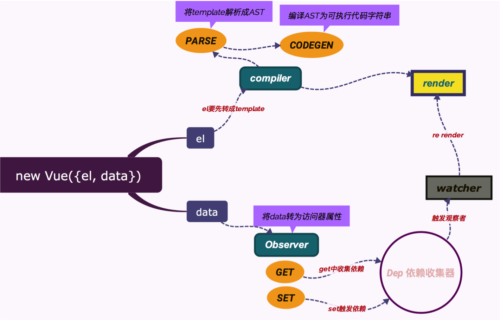

# Vue 源码学习（整体初始化流程）
## 前言

本文基于Vue 2.4.1，讲的是Vue执行的大致流程，不涉及具体细节

## 寻找构造函数

从`package.json`查看，构建项目指令`npm run dev`的指令为`rollup -w -c build/config.js --environment TARGET:web-full-dev`，查看`build\config`

```javascript
// ...
'web-full-dev': {
    entry: resolve('web/entry-runtime-with-compiler.js'),
    dest: resolve('dist/vue.js'),
    format: 'umd',
    env: 'development',
    alias: { he: './entity-decoder' },
    banner
  }
// ...
```

在这里，找到了Vue的构建入口为`src\plateforms\web\entry-runtime-with-compiler.js`。在这里找到`Vue`的引用在`web\runtime\index.js`，接着找到`core\index`，在这里挂载Vue的全局API，这里先不理会，继续找Vue的构造函数。最后在`core\instance\index.js`找到Vue的构造函数

## 流程入口

```javascript
function Vue (options) {
  if (process.env.NODE_ENV !== 'production' &&
    !(this instanceof Vue)
  ) {
    warn('Vue is a constructor and should be called with the `new` keyword')
  }
  // 初始化入口
  this._init(options)
}
// 这里是加载Vue的内部api
initMixin(Vue) // 加载this._init()
stateMixin(Vue)
eventsMixin(Vue)
lifecycleMixin(Vue)
renderMixin(Vue)
```

## 实例的初始化
当我们``new Vue(options)``的时候，就进入构造函数，并执行``this._init(options)``进行初始化。在这里，``this._init()``定义在`core\instance\init`的``initMinxin``下。

```javascript
  Vue.prototype._init = function (options?: Object) {
    const vm: Component = this
    // 组件和实例的唯一id
    // 加载的插件也会有id例如vuex和vue-router
    vm._uid = uid++

     /* 代码忽略 */

    // a flag to avoid this being observed
    vm._isVue = true
    // merge options
    if (options && options._isComponent) {
      // 组件的内部初始化
      initInternalComponent(vm, options)
    } else {
        // Vue实例的options处理，挂载在$options
      vm.$options = mergeOptions(
        resolveConstructorOptions(vm.constructor),
        options || {},
        vm
      )
    }
   
    /* 代码忽略 */
    // 下面是一些初始化定义，不影响主流程细节太多不详细讲
    vm._self = vm
    // 生命周期的初始化，一些状态，例如_isMounted、_isDestroyed
    initLifecycle(vm) 
    // 初始化监听事件
    initEvents(vm)
    // 初始化render，例如定义vnode的根节点变量，处理slotd等
    initRender(vm)
    // 执行beforeCreate 钩子函数
    callHook(vm, 'beforeCreate')
    // 这个是注入，在官方文档解释是为高级组件提供的api，业务开发几乎不用
    initInjections(vm) // resolve injections before data/props
    // 这是处理data/props/computed等属性，先跳过，后面会详细讲
    initState(vm)
    // resolve provide after data/props
    initProvide(vm) 
    // 执行created钩子函数
    callHook(vm, 'created')

    /* 代码忽略 */

    // 如果有如果设置中有带 el 属性，一般在实例的挂载上会有，或者一些组件
    // 例如toast这种用完即销毁的组件会带有
    if (vm.$options.el) {
      // Vue实例挂载开始
      // 这个是个实例方法，是将实例/组件挂载到DOM元素上
      vm.$mount(vm.$options.el)
    }
  }
}
```
到这里，就能发现，全局的api和属性在`core\global-api`，组件实例内部的的方法属性在`core\instance`下。

## 实例/组件的挂载流程

在执行`vm.$mount(vm.$options.el)`时，进入的是在`platforms\web\entry-runtime-with-compiler.js`里的`Vue.prototype.$mount`，挂载在Vue的原型上。

在这里有段代码

```javascript
const mount = Vue.prototype.$mount
```

这个mount在`platforms\web\runtime\index.js`上，在这里为了挂载实例方法，把``$mount``作为缓存在了``mount``上，以便以下面的调用

### 模板编译和render函数执行
接下来的，是编译模板。这里只讲个生成render函数的流程。

在这里举个例子，就是``<App/>``，其他道理都相同，就是生成render函数。这个``render函数``在[Vue官网](https://cn.vuejs.org/v2/guide/render-function.html)里有详细说明，通过``render函数``可以生成Vnode就是``Virtual Dom``，进而渲染dom

Vue获取``<App />``字符串 --> 判断是否能够``new Function`` --> 拼接render生成字符串 ``render:"with(this){return _c('App')}"`` --> 通过 ``new Function(code)`` 生成真实render函数并挂载到``options``上

```javascript
// 预挂载
Vue.prototype.$mount = function (
  el?: string | Element,
  hydrating?: boolean
): Component {
  // 挂载的DOM节点，可以是真是DOM也可以是一个id
  el = el && query(el)

  /* 代码忽略 */

  const options = this.$options
  // 如果有render函数，就不用进行模板编译-->render function
  // 并挂载在options上
  if (!options.render) {
    let template = options.template

    /* 代码忽略，这里都是在取得模板字符串的过程，不重要 */
    
    if (template) {
      /* istanbul ignore if */
      if (process.env.NODE_ENV !== 'production' && config.performance && mark) {
        mark('compile')
      }
      // 在这里，字符串-->function str --> create render function
      const { render, staticRenderFns } = compileToFunctions(template, {
        shouldDecodeNewlines,
        delimiters: options.delimiters,
        comments: options.comments
      }, this)
      options.render = render
      options.staticRenderFns = staticRenderFns

      /* istanbul ignore if */
      if (process.env.NODE_ENV !== 'production' && config.performance && mark) {
        mark('compile end')
        measure(`${this._name} compile`, 'compile', 'compile end')
      }
    }
  }
  // 调用挂载函数
  return mount.call(this, el, hydrating)
}
```

## Wactcher 观察者

在Vue2.0中，采用了跟React一样的``Virtual Dom``技术，对比虚拟与真实dom的区别，做到最小化操作dom，render函数就是为了生成``Vnode``的。作为数据驱动的mvvm框架，Vue采用的是``数据劫持+发布订阅的模式``，为``data/computed/props``等进行了数据绑定，实现了数据的响应式响应式，而作为Vue的``组件/实例``，也拥有一个观察者。看到`core\instance\lifecycle`

```javascript
export function mountComponent (
  vm: Component,
  el: ?Element,
  hydrating?: boolean
): Component {
  vm.$el = el
  if (!vm.$options.render) {
    /* 代码忽略，无render函数会警告 */
  }
  // 调用beforeMount
  callHook(vm, 'beforeMount')

  let updateComponent
  /* istanbul ignore if */
  if (process.env.NODE_ENV !== 'production' && config.performance && mark) {
    /* 代码忽略，开发者模式下的一些性能追踪功能 */
  } else {
    // 渲染入口，递给Watcher
    updateComponent = () => {
      vm._update(vm._render(), hydrating)
    }
  }
  // 生成Watcher实例并挂载在vm
  // 所有的初始化业务都从这里开始
  vm._watcher = new Watcher(vm, updateComponent, noop)
  hydrating = false

  // dom更新完调用mounted钩子函数
  if (vm.$vnode == null) {
    vm._isMounted = true
    callHook(vm, 'mounted')
  }
  return vm
}
```
接下来看``core\observer\watcher.js``。这个是watcher构造函数的入口。

```javascript
// wathcer的唯一标识符
let uid = 0

export default class Watcher {
  vm: Component;
  expression: string;
  cb: Function;
  id: number;
  deep: boolean;
  user: boolean;
  lazy: boolean;
  sync: boolean;
  dirty: boolean;
  active: boolean;
  deps: Array<Dep>;
  newDeps: Array<Dep>;
  depIds: ISet;
  newDepIds: ISet;
  getter: Function;
  value: any;

  constructor (
    vm: Component,
    expOrFn: string | Function,
    cb: Function,
    options?: Object
  ) {
    this.vm = vm
    // 将实例push进vm
    vm._watchers.push(this)
    
    /* 代码忽略，各种wathcher的属性配置 */

    // 把updateComponent赋给getter
    if (typeof expOrFn === 'function') {
      this.getter = expOrFn
    } 

    /* 代码忽略 */

    // 这里进行get的调用
    this.value = this.lazy
      ? undefined
      : this.get()
  }


  get () {
    pushTarget(this)
    let value
    const vm = this.vm
    try {
      // 执行 vm._update(vm._render(), hydrating)
      value = this.getter.call(vm, vm)
    } 
    /* 代码忽略 */
    return value
  }
```
到这里，watcher的初始化就完成了。当Vue以及其组件进行数据更新的时候，会通过数据的``setter``，去通知``Watcher``调用渲染，通过``virtual dom``实现dom的更新。后面是Vdom的生成``patch/diff/update``过程

## Virtual Dom 大致流程以及组件渲染

先是执行``render函数``，看到``core\instance\render.js``

```javascript
  Vue.prototype._render = function (): VNode {
    const vm: Component = this
    const {
      render,
      staticRenderFns,
      _parentVnode
    } = vm.$options

    let vnode
    try {
      // 这里生成vnode，其实就是执行render函数，并作为参数去update
      vnode = render.call(vm._renderProxy, vm.$createElement)
    }
    return vnode
  }
```
看到``core\instance\lifecycle.js``
```javascript
Vue.prototype._update = function (vnode: VNode, hydrating?: boolean) {
    /* 代码忽略 */

    if (!prevVnode) {
      // 对vnode进行patch，这是virtual dom 最重要的步骤
      vm.$el = vm.__patch__(
        vm.$el, vnode, hydrating, false /* removeOnly */,
        vm.$options._parentElm,
        vm.$options._refElm
      )
      // no need for the ref nodes after initial patch
      // this prevents keeping a detached DOM tree in memory (#5851)
      vm.$options._parentElm = vm.$options._refElm = null
    } else {
      // updates
      vm.$el = vm.__patch__(prevVnode, vnode)
    }
    /* 代码忽略 */
  }
```
执行到``__pathch__``，后面就是``virtual dom``的``diff``和``patch``的过程，在这里不会深入探讨，但是要完成整个流程，组件还需要去递归，递归的如果就在patch中。

## VueComponent 组件初始化
``VueComponent``是组件的构造函数，实质上是继承了``Vue``的一个子类。

```javascript
// 定义VueComponent构造函数
const Sub = function VueComponent (options) {
    // 同样执行Vue.prototype._init
    this._init(options)
  }
// 继承Vue
Sub.prototype = Object.create(Super.prototype)
// 修改构造函数
Sub.prototype.constructor = Sub
Sub.cid = cid++
// 合并options
Sub.options = mergeOptions(
  Super.options,
  extendOptions
)
// 父类挂载
Sub['super'] = Super
```
在编译完的``Vnode``如果是组件，都会有一个``_Ctor``属性，如果我们通过``webpack``，import 进来的一整个组件配置，也有这么个属性。这个属性存放的就是``VueComponent``构造函数。当然这个函数是在编译的时候进行加工过的，把一些属性，例如``data`` ``computed`` 等的属性进行了初始化等。
看到``core\vdom\create-component.js``

```javascript
export function createComponentInstanceForVnode (
  vnode: any, // we know it's MountedComponentVNode but flow doesn't
  parent: any, // activeInstance in lifecycle state
  parentElm?: ?Node,
  refElm?: ?Node
): Component {
  // 缓存构造函数
  // 这个componentOptions在Vnode生成的时候，把_Ctor属性挂载在componentOptions
  const vnodeComponentOptions = vnode.componentOptions
  const options: InternalComponentOptions = {
    _isComponent: true,
    parent,
    propsData: vnodeComponentOptions.propsData,
    _componentTag: vnodeComponentOptions.tag,
    _parentVnode: vnode,
    _parentListeners: vnodeComponentOptions.listeners,
    _renderChildren: vnodeComponentOptions.children,
    _parentElm: parentElm || null,
    _refElm: refElm || null
  }
  // check inline-template render functions
  const inlineTemplate = vnode.data.inlineTemplate
  if (isDef(inlineTemplate)) {
    options.render = inlineTemplate.render
    options.staticRenderFns = inlineTemplate.staticRenderFns
  }
  // new VueComponent(options)
  return new vnodeComponentOptions.Ctor(options)
}
```

## 结语

至此为止，整个Vue的创建流程就结束了。在这里，忽略了``模板编译``、``Virtual Dom`` 和 ``双向绑定原理``，因为这三个篇幅非常长，日后会单独拿出来写。下面这图是网上的原理图，整个的流程大概是这样了。


